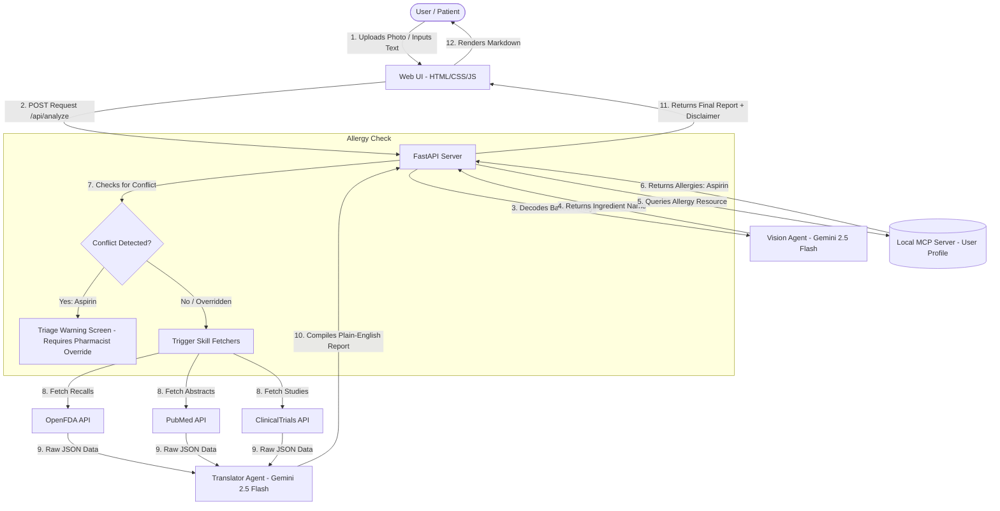

# Kaggle Capstone Submission Writeup: MediSafe 🛡️

**Project Name**: MediSafe - The Plain-English Medicine Safety Guardian  
**Target Track**: Agents for Good / Concierge Agents  
**Authors**: Joe  
**Public Code Repository**: [GitHub Link Placeholder]  
**Interactive Demo Link**: https://medisafe-277759971577.asia-east1.run.app  

---

## 1. Problem Statement & Core Concept
Every year, millions of patients return home from clinics or pharmacies with prescription bags and over-the-counter medicine bottles covered in dense chemical ingredients, complex medical terms, and long warnings. For the average layperson, reading these labels is confusing, stressful, and often leads to non-compliance or accidental adverse drug interactions. 

**MediSafe** is an AI-powered medical translation assistant designed to bridge this gap. Using a multimodal agent architecture, patients can simply take a photo of their medicine package. The system extracts the active ingredients, queries authoritative databases (OpenFDA, PubMed, and ClinicalTrials.gov), and translates raw clinical data into an empathetic, easy-to-read, plain-English safety report.

---

## 2. Key Concepts Demonstrated (Curriculum Integration)
MediSafe explicitly implements the core engineering patterns taught during the 5-Day Google AI Agents course (Day 1 to Day 4):

### Day 1: New SDLC & Vibe Coding
We leveraged Antigravity's agentic IDE to transition from specification to rapid prototyping. We designed a distinct **Empathetic Pharmacist Persona** for the Coordinator Agent, controlling the output tone, vocabulary complexity (writing for a layperson), and safety structure.
- **Bilingual Interface & Report Re-translation**: Designed a toggle header supporting English and Traditional Chinese, translating UI templates and re-summarizing reports dynamically.

### Day 2: Model Context Protocol (MCP)
To securely reference user-specific health records, we implemented a simulated **User Health Profile MCP Server** (`mcp://user/profile`). Rather than using simple local imports, our coordinator agent launches the server as an independent subprocess and communicates strictly over a **Standard-Compliant JSON-RPC 2.0 stdio transport protocol**. Before generating any report, the agent queries this MCP resource to retrieve the patient's name, active medications, and documented allergies (e.g., `Aspirin` and `Penicillin`), preventing sensitive medical data from being hardcoded or directly exposed to the internet. This standard-compliant interoperability allows this server to be plugged into any enterprise-grade hospital database without changes.

### Day 3: Custom Agent Skills
We built and packaged custom data-fetching tools in Python that communicate directly with REST APIs:
- **OpenFDA Skill**: Queries FDA enforcement reports to identify active recalls or batch quality issues.
- **PubMed Skill**: Retrieves latest scientific literature abstracts regarding ingredient safety.
- **ClinicalTrials.gov Skill**: Pulls ongoing research trials associated with the drug.
- **Project-Scoped Agent Skill (`medisafe-expert`)**: A custom-scoped Antigravity skill mapping project architecture and code guidelines to keep future edits safe.

### Day 4: Agent Security, Governance & Human-in-the-Loop (HITL)
Safety is paramount in healthcare AI. MediSafe implements multiple security, safety, and compliance guardrails:
1. **HITL Triage Gate**: If the Vision Agent extracts a drug that conflicts with patient allergies retrieved via MCP, the system flags `requires_triage`. The UI locks, displays a red warning modal, and requires a manual **Pharmacist Triage Override** button click (Human-in-the-Loop) before showing the report.
2. **Paved Roads & TDD Gate (`CONTEXT.md`)**: Restricts agent code updates (enforcing Pydantic validations, blocking shell tool-use) and mandates "Security Boundaries & Assertions" in plans.
3. **PreToolUse Hook (`hooks.json` & validation script)**: Automatically intercepts all terminal command executions. Instead of simple string checks, the validator runs **Structural AST & Path Traversal Checking (Sandbox Containment)**, parsing command tokens with `shlex` and verifying all path parameters fall strictly within the workspace boundary to prevent prompt-injection escapes or command chaining (`;`, `&&`, etc.).
4. **Git Pre-Commit Secrets Scanner**: Local Semgrep scanner rule (`rules.yaml`) detecting and blocking Gemini API key leaks (`AIzaSy...`) on commit.
5. **Standardized Pytest Security Suite**: Automated unit tests (`tests/test_security_pytest.py`) validating allergy triage block, override logic, and AI chat bot replies.

---

## 3. High-Fidelity Consumer UX Features (Day 4 Upgrades)
To turn MediSafe into a premium, interactive health concierge, we implemented:
- **🟢 Visual Safety Traffic Lights**: Emotive safety badges (🟢 SAFE, 🟡 WARNING, 🔴 DANGER) reflecting recalls and allergy conflicts instantly.
- **💊 CSS 3D Pill Visualizer**: An animated, floating 3D pill matching the capsule/tablet type and actual color of the analyzed drug.
- **🍷 Food Contraindication Grid**: Visual grid detailing safety checks for Alcohol, Dairy, Grapefruit, and Caffeine.
- **🔊 Speech Synthesis TTS**: Reads reports aloud in English or Mandarin with Markdown cleanup.
- **👶 Pediatric Dosage Calculator**: Interactive weight slider estimating safe dosage ranges (mg) on-the-fly.
- **⏰ Smart Dose Reminders**: Generates and downloads `.ics` files for Apple/Google/Outlook Calendar alarms.
- **📄 Export to PDF**: Renders safety reports cleanly using custom `@media print` stylesheets.
- **💬 Follow-up AI Pharmacist Chat**: A chat box allowing patients to ask warm, context-backed questions about their medication.

---

## 4. Architecture & Data Flow

---

## 5. Local Installation & Run Guide
Please refer to the `README.md` in our repository for detailed instructions on setting up python dependencies, managing the `.env` file, starting the FastAPI server, opening the Web UI, and running the local evaluation suites:
- Run evaluation script: `python tests/eval_agent.py`
- Run pytest suite: `python -m pytest tests/test_security_pytest.py`
